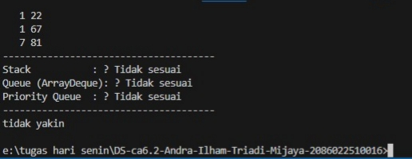

Mengapa outputnya seperti itu ? Output itu muncul karna nilai yang keluar ( 81 ) itu tidak pernah dimasukkan ke dalam sistem sebelumnya, sehingga tidak memenuhi aturan LIFO (Stack), FIFO (Queue), maupun Prioritas (Priority Queue).Karena angka yang keluar dianggap sebagai "data asing" yang tidak ada dalam antrean input ( 22 dan 67 ), program menyimpulkan bahwa perilaku data tersebut tidak sesuai dengan struktur data standar mana pun.